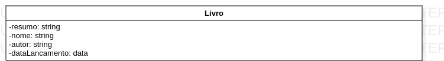
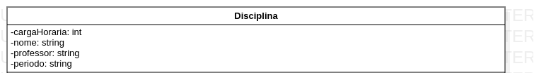
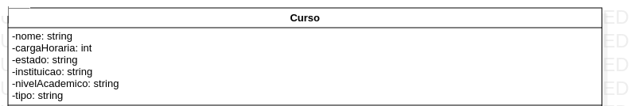
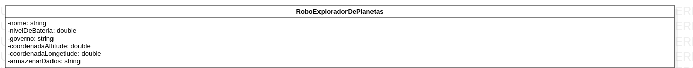

## Livro
Abstração realizada baseando-se , em o que tem na frente e atrás de um livro.

## Disciplina
Abstração realizda baseando-se , em um aluno identificando uma matéria para realizar durante o semestre. 

## Curso
Abstração realizda baseando-se , em um aluno identificando um curso para de interesse para cursar. 

## Robô explorador de planetas
Abstração realizda baseando-se, em um robo sendo enviado para marte.

## Datagrama IPv4
Abstração realizda baseando-se , conceitos de um livro de redes de computadores com caracteristica de um datagrama Ipv4.

