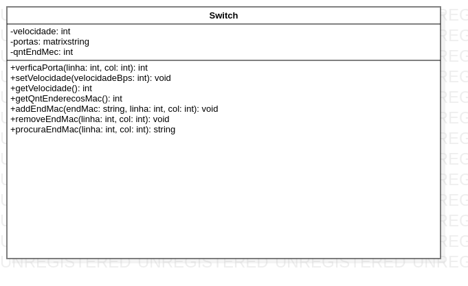

# Modelagem de classes em UML – com atributos e métodos
## Comutador de rede(Switch)
Abstração realizada baseando-se , em um aluno analisando um switch de 20 portas pertencente a seu laboratorio de redes de aula.

